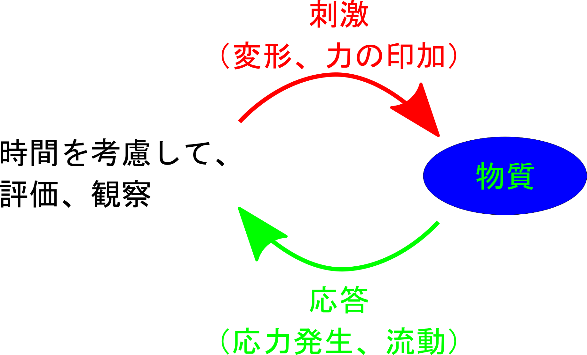

# 第4章 「動的粘弾性について」

では、第3章の2つ目のトピックである動的粘弾性について説明します。
ここでは、以下の3つの要素について説明します。
粘弾性、粘弾性体の動的な刺激への応答、そして粘弾性性スペクトルです。

## 粘弾性とは

まず、粘弾性についてから説明します。

### 粘性、弾性、粘弾性

#### レオロジーについて

レオロジーのアプローチから始めましょう。

レオロジーとは、物質に刺激を与えてその応答を評価・観察することで特性を評価する学問です。
ここでは、物質の力学的な応答である弾性と粘性に焦点を当てて検討します。

{#fig:Rheo_method width=80% }

まず、固体と液体の応答について考えます。
固体のモデルでは、応力が歪に比例するとされ、これはバネに例えられます。
このモデルでは、時間の影響は関係ありません。
一方、液体のモデルでは、力がひずみ速度に比例するため、時間の因子が非常に重要です。
これは、水などの液体中に邪魔板が移動するようなダッシュポットとして例えられます。

{#fig: width=% }

1942年にレオロジーの初期に、物質を粘性と弾性に分けることが試みられました。
の左側が固体的な弾性応答を表し、右側に液体的な流動に分類されるものが示されています。
しかし、実際には、粘性と弾性を合わせ持った物質が多く存在し、単純に分けられるわけではありません。

このような性質を持つ粘弾性は、液体の流動性と固体の変形性を組み合わせた複雑な性質です。
これを非常に単純化したモデルとして、弾性を表すバネと粘性を表すダッシュポットを組み合わせたマックスウェルモデルが提案されます。
これは、右の図に示されています。
このモデルでは、外部からの刺激に対してバネとダッシュポットが連携して応答します。

マックスウェルモデルでは、歪みを与えた後、応力がしだいに減少する現象が見られます。
これは、応力緩和と呼ばれます。
これは、粒子の運動が変化し、居心地の改善が起こることによって生じる現象です。

その結果、極所的な応力が消失していくわけです。
この応力緩和の挙動をマックスウェルモデルで数式的に解析すると、応力自体は初期の応力から指数関数的に減少していくことが示されます。
そして、時間τ経過後には、結局応力は初期応力の1/eになります。
この定義はいくつかの方法で行えますが、もっとも便利な定義方法です。
緩和時間は、時間の次元を持つ横軸がτ 経過した時、つまり応力が1/eになる時点を指し、これを緩和時間と定義します。
緩和時間を詳しく見てみると、マックスウェルモデルのダッシュポット由来の粘度とバネ由来の弾性率の比が、緩和時間に対応することになります。細かいことは置いておきますが、この比率ではτ は時間の次元を持つことになります。
そして、この知識からわかるように、緩和時間は弾性応答の性質の弾性率に反比例し、粘度に比例します。

粘弾性についてまとめますと、粘性と弾性を考えると、個々のモデルはバネが固体、液体がダッシュポットであり、特に液体の場合、ダッシュポットの使用されたモデルでは時間の因子が重要になってきます。
これらを組み合わせた粘弾性をモデル化しますが、粘性と弾性を合わせ持つものは非常に多くあります。
そして、その非常に単純化したモデルとして、直列につなげたマックスウェルモデルがあります。
粘弾性の応答として、歪みを加えると、その歪みを保持しながら徐々に応力が減少していく緩和現象が特徴的です。
この緩和現象の1つの特徴的な要素は、緩和時間という概念で説明できます。

