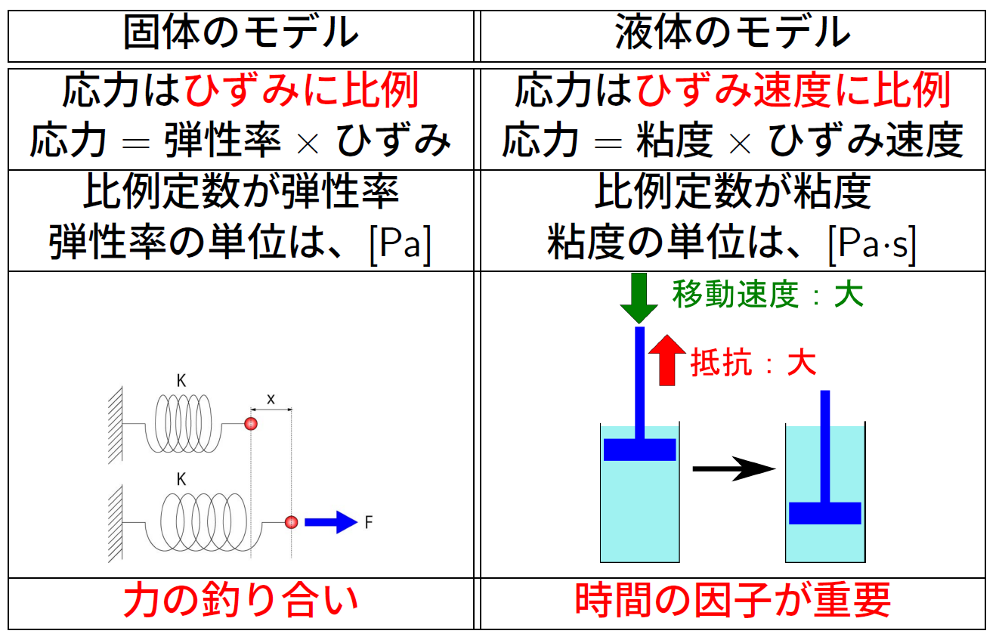
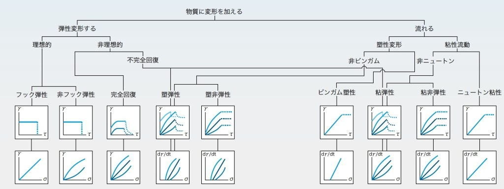
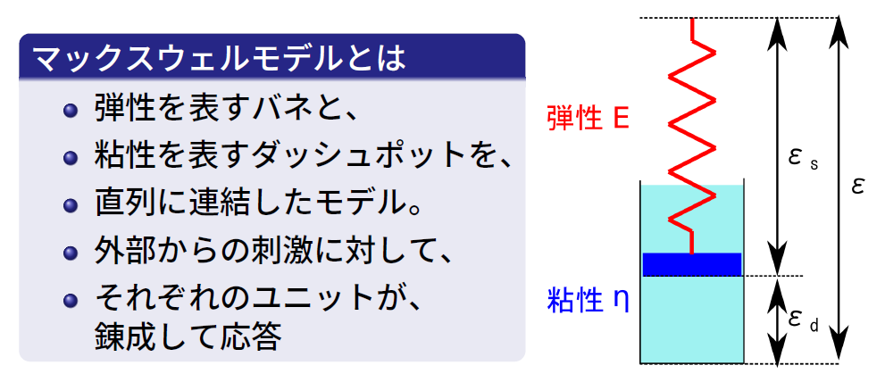
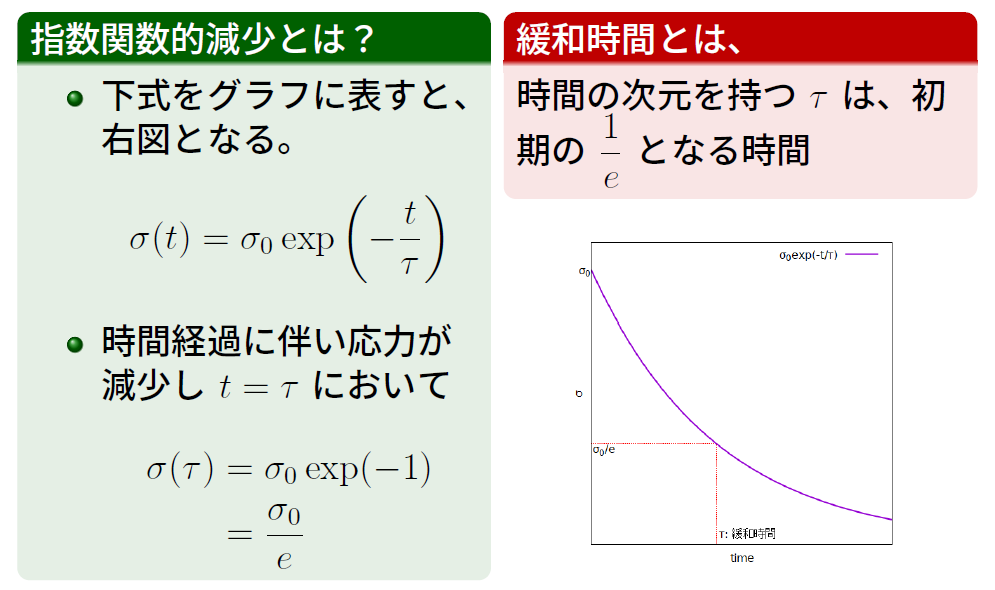
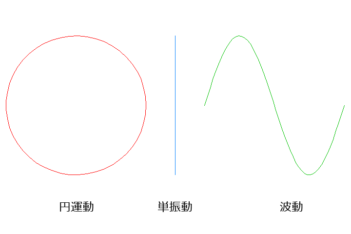

# 第4章 「動的粘弾性について」

では、第3章の2つ目のトピックである動的粘弾性について説明します。

ここでは、以下の3つの要素について説明します。
粘弾性、粘弾性体の動的な刺激への応答、そして粘弾性性スペクトルです。

## 粘弾性とは

まず、粘弾性についてから説明します。

### 粘性、弾性、粘弾性

#### レオロジーについて

<!-- レオロジーのアプローチから始めましょう。 -->
レオロジーとは、物質に刺激を与えてその応答を評価・観察することで、その特性を評価する学問です。
ここでは、物質の力学的な応答である弾性と粘性に焦点を当てて説明します。

{#fig:Rheo_method width=80% }

#### 固体と液体のモデル

まず、固体と液体の応答について考えます。
固体のモデルでは、応力が歪に比例するとされ、これはバネに例えられます。
このモデルでは、時間の影響は関係ありません。

一方、液体のモデルでは、力がひずみ速度に比例するため、時間の因子が非常に重要です。
これは、水などの液体中に邪魔板が移動するようなダッシュポットとして例えられます。

この両方の特性をまとめると、[@fig:solid_liquid]のようになります。

{#fig:solid_liquid width=80% }

#### 固体と液体の応答の分類

レオロジー研究の初期の段階において、物質のレオロジー的な応答を粘性と弾性に分けることが試みられました^[これは、1942年に発表された論文でした。Nature 1942 v149-3790, p702]。

[@fig:rheology_bunrui]の左側が固体的な弾性的な応答を示すものとなり、右側に液体的な流動という応答に分類されるものがまとめられています。
しかし、実際には、粘性と弾性を合わせ持った物質が多く存在し、単純に分けられるわけではありません。

{#fig:rheology_bunrui width=80% }

### 粘弾性のモデル

粘弾性とは、液体の性質である流動性と固体の性質である変形してもとに戻るという弾性的な応答を併せ持った複雑な性質です。

これを非常に単純化したモデルとして、弾性を表すバネと粘性を表すダッシュポットを組み合わせたマックスウェルモデルが提案されています。
このモデルでは、外部からの刺激に対してバネとダッシュポットが錬成して応答します。

{#fig:maxwell_model_list width=80% }

### 応力緩和

粘弾性を示す物質では、マクロに歪みを与えてその状態を維持すると、応力がしだいに減少する現象が見られて、応力緩和と呼ばれています。

このマクロな応力の低下をミクロに考えてみましょう。
詳細は省略しますが、この現象は物質の内部で粒子の居心地が変化して、その改善の過程で流動が起きて局所的な応力が消失すると捉えることができます。
この局所的な緩和が繰り返されて、マクロな応力緩和という現象が生じているのです。

{#fig:ouryoku_kanwa_1 width=80% }

#### マックスウェルモデルによる応力緩和

この応力緩和の挙動をマックスウェルモデルで数式的に解析すると、[@eq:maxwell_kanwa]で表すことができて、初期の応力から指数関数的に減少していくことが示されます。
$$\sigma(t) = \sigma_0 \exp \left(-\dfrac{t}{\tau} \right)$$
{#eq:maxwell_kanwa}

そして、[@fig:ouryoku_kanwa_2]に示したように、$t=\tau$において応力は初期応力$\sigma_0$の$1/e$になります。

{#fig:ouryoku_kanwa_2 width=80% }

### 緩和時間とは

#### マックスウェルモデルでの緩和時間

前述のように、緩和時間は、応答が初期の状態（ここでは初期応力$\sigma_0$）の$1/e$になる時間$\tau$として定義されています。
ここでは導出を省略したマックスウェルモデルで見た応力緩和過程の数式展開において、マックスウェルモデルのダッシュポット由来の粘度$\eta$とバネ由来の弾性率$G$の比が、緩和時間$\tau$に対応することになります。
$$\tau = \dfrac{\eta}{E}$$
{#eq:kanwa}

天下りになりますが、緩和時間に関する事項を簡単にまとめると、以下のようになります。

* 弾性モデルにおける弾性率$E$の単位は$\mathrm{Pa}$
* 粘性モデルにおける粘度$\eta$の単位は$\mathrm{Pa}\cdot\mathrm{s}$
* その比となる$\tau$は時間の次元[T] を持ち、緩和時間と呼ばれます。
* 緩和時間とは、物質のひずみに対する力学応答が指数関数的に減少するさまを表す特徴的な時間。

#### 緩和時間の意味

そして、緩和時間の振る舞いは、[@eq:kanwa]の定義からわかるように以下のような特徴を持っています。

* 弾性応答の性質を表す弾性率に反比例し、
* 粘性応答の度合いを表す粘度に比例します。

したがって、固体的な特徴である弾性率が大きくなると緩和時間は長くなりますし、逆に液体的な特徴の粘度が増加すれば緩和時間は短くなることになります。

### まとめ

ここでの内容をまとめると以下のようになります。

* 粘性と弾性についての再確認
  * 固体のモデルはバネ、液体はダッシュポット
  * 液体の粘性は「時間の因子が重要」
* 粘弾性のモデル化
  * 多くの物質は粘性と弾性を併せ持つ。
  * 粘弾性のモデルはバネとダッシュポットを
  * 直列したマックスウェルモデル
* 粘弾性の応答
  * ひずみを付与した応力緩和が特徴的
  * 緩和現象は緩和時間で説明できる。
  
<!-- 粘弾性についてまとめますと、粘性と弾性を考えると、個々のモデルはバネが固体、液体がダッシュポットであり、とくに液体の場合、ダッシュポットの使用されたモデルでは時間の因子が重要になってきます。
これらを組み合わせた粘弾性をモデル化しますが、粘性と弾性を合わせ持つものは非常に多くあります。
そして、その非常に単純化したモデルとして、直列につなげたマックスウェルモデルがあります。
粘弾性の応答として、歪みを加えると、その歪みを保持しながら徐々に応力が減少していく緩和現象が特徴的です。
この緩和現象の1つの特徴的な要素は、緩和時間という概念で説明できます。 -->

## 動的粘弾性について

### 動的な刺激に対する応答

次に、動的な刺激に対する応答について説明します。
レオロジーとは、刺激を与えてその応答の評価するわけですが、周期的に変化する「動的な刺激」を考えることになります。

#### 周期的な入力とは？

動的な刺激を考える場合、一般的に、周期的な変化である波（波動）を考えることになります。
波は、三角関数である$\sin$や$\cos$を用いて表されます。
そして、円運動、単振動というような見た目の異なる周期的な運動も、三角関数を用いて表現できます。
[@fig:vib]にそのイメージを示しました。

{#fig:vib width=80% }

#### 動的なひずみ

動的な刺激として、周期的に時間変化する歪$\gamma(t)$を考えます。
このとき、時間に依存したひずみ量の変化は、時間$t$を変数とする三角関数を用いて以下のように記述できます。
$$\gamma (t) = \gamma_0 \sin(\omega t)$$

なお、$\gamma_0$が最大ひずみ、$\omega$は角周波数で回転速度を表すスカラー量です。

角周波数$\omega$は以下のように定義されます。
$$\omega \equiv \dfrac{\mathrm{d} \theta}{\mathrm{d} t} = \dfrac{2 \pi}{T} = 2\pi f$$

なお、$\theta$は角度(単位：ラジアン)、$T$は周期(単位：秒)、$f$は周波数(単位：ヘルツ)です。
$\theta$が無次元量ですから$\omega$の次元は$T^{−1}$、SI単位はラジアン毎秒(rad/s)となり、そして、角周波数は通常の周波数を単純に$2\pi$倍したものとなります。

#### 動的な刺激と応答の評価

この同様な刺激に対する応答を評価する必要があります。
したがって、周期的な変形を入力として与えた場合、応力がどのように返ってくるかを見たいのです。
比較する方法は、同軸に並べて比較するか、直交した形で評価することです。
これらの方法を用いれば、目で見て理解しやすくなります。

粘弾性測定の場合、入力と出力の周期は同じです。したがって、非常に単純な場合です。

これから、イメージを持って、この入力が加わった時に応力がどのように変化するかを見ていきたいと思います。

このイメージを表現する1つの方法として、リサージュ曲線があります。これは、直交する2つの単振動を合成して平面図形を描いたもので、一般に、入力をx軸、出力をy軸として用いられます。電気技師たちは、この方法を用いて周波数測定を行います。

#### 位相とは？

さて、位相について少し説明します。
位相は、周期的に変動する波の位置情報を意味します。例えば、入力信号がA sin(Ωt + 5)の形で表された場合、Ωt + 5が位相であり、T=0の時の位相が5で初期位相と呼ばれます。このとき、Aは振幅に対応し、Ωは各周波数で、5が初期位相を表します。異なる波の位相を比較する場合、それぞれの初期相の差が位相差となります。位相差が50が正の場合を位相進み、負の場合を位相遅れと定義します。

### 理想的な弾性固体や粘性液体の応答

以上が、粘弾性体に動的な刺激が加わる際の基本的な固体と液体の挙動についての説明です。
固体の場合は弾性体として、液体の場合は粘性体として考えられます。

粘性液体の理想的な場合は、異なる動作を示します。ここでは、ダッシュポットを用いて、波のシグナルを入力し、それを図で表現します。ストレインは、弾性と同じものであり、その微分は実際にはcosとなります。つまり、この場合、移動速度が最大となる位置で応力も最大となります。これをsinで表すと、入力がsin(Ωt)の場合、出力はsin(Ωt + 2)となり、位相が52進んで応答します。リサージュ図では、これが楕円状に表され、横軸と対応しています。

さらに、この応答をリサージュ曲線で表現し、入力と揃った男性的な応答と、位相が進んだ応答に分解します。これにより、弾性的な応答を表す貯蔵男性率と、損失男性率が定義されます。そして、これらの性質を表すために、タンデルタンジェントも用いられます。

これらの概念をまとめると、動的粘弾性測定は、角周波数、歪み量、温度などのパラメーターを変更し、貯蔵男性率、損失断性率、タンジェントデルタなどを測定するものです。この測定は、線形応答の枠組みで行われることが前提ですが、実際の測定では、非線形応答も重要視されます。

線形応答の観点からは、微小な歪みを入力する必要があります。これについて説明します。リサージュ曲線は、非線形応答でよく見られる、変わった形状の曲線です。通常、0.2程度の歪みまでは、単純な線形粘弾性の議論で扱われる傾いた楕円のリサージュ曲線ですが、0.2を超えると、形状が変化し、歪みが10を超えると、線形応答の傾いた楕円の形状になりません。ゴムなどの材料は大きく変形するため、このような場合の振る舞いについての議論が最近行われていますが、これは今説明した枠組みでは議論できませんので、一旦置いておきます。

歪みの増加に伴う貯蔵弾性率G'と損失弾性率の変化を調べるためには、歪み依存性を測定することが知られています。これは、小さな歪みから徐々に大きな歪みに増やしていくことです。最初は、線形応答であれば貯蔵弾性率G'は変化せず、損失弾性率も一定です。しかし、歪みが大きくなると非線形領域に入り、複雑な高次の成分が無視できなくなります。このような場合でも、貯蔵弾性率や損失弾性率は線形応答の間は一定ですが、それ以外の範囲では一定ではなく、増減することがあります。このような線形弾性率で測定しないと、先述の枠組みは成り立ちません。

次に、動的な刺激への応答について簡単にまとめます。動的な刺激とは、時間経過とともに周期的に変化する歪みや応力のことです。周期は線形応答であれば同じですが、振幅や位相が異なる応答が得られます。固体では同位相の応答が得られますが、粘性体では位相が52だけ進んだ応答が得られます。これらの重ね合わせにより、粘弾性体では少し進んだ位相の応答が得られます。これらを線形応答の範囲でうまく分割して使用することで、動的粘弾性測定が行われます。この枠組みは、線形応答が得られる場合にのみ成り立つため、歪み量に十分注意する必要があります。